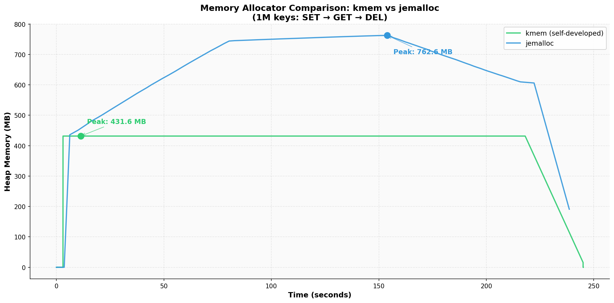
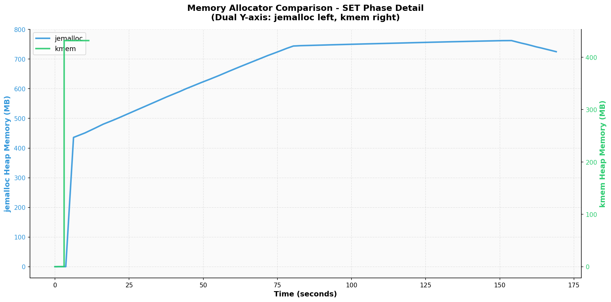
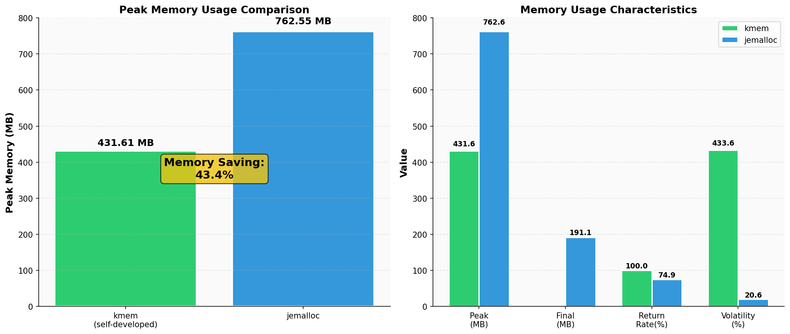

# Kedis: 高性能 Linux 内核增强型存储系统

[](LICENSE)
[]()
[]()

Kedis 是一个面向极致性能设计、基于 **io_uring** 异步 I/O 框架、支持**多存储引擎**、**内核级主从同步**及 **RDMA 硬件加速**的 Key-Value 存储系统。

本项目深度集成 Linux 内核增强技术（io_uring, eBPF, mmap）和 RDMA 技术，旨在构建一个能够支撑百万级并发、低延迟、且具备非侵入式实时数据同步能力的高性能存储基座。本项目尝试从用户态到内核态探索全栈优化的可能性，希望能为高性能服务器架构、内核驱动开发及分布式系统相关研究提供一些参考。

---

## 目录

- [项目介绍](#项目介绍)
  - [核心架构亮点](#核心架构亮点)
  - [核心组件说明](#核心组件说明)
- [架构设计](#架构设计)
  - [网络模型：基于 io_uring 的 Proactor](#网络模型基于-io_uring-的-proactor)
  - [同步体系：eBPF 实时增量 + RDMA 存量全量](#同步体系ebpf-实时增量--rdma-存量全量)
  - [存储引擎：四种数据结构组成的多引擎架构](#存储引擎四种数据结构组成的多引擎架构)
- [Q&A](#Q&A)
- [快速开始](#快速开始)
  - [环境要求](#环境要求)
  - [编译构建](#编译构建)
  - [运行指南](#运行指南)
    - [启动服务器](#启动服务器)
    - [启动 eBPF 镜像同步](#启动-ebpf-镜像同步)
- [性能测试](#性能测试)
  - [Hardware Spec](#hardware-spec)
  - [持久化性能数据](#持久化性能数据)
  - [引擎性能对比测试 (SET/GET)](#引擎性能对比测试-setget)
  - [混合负载性能测试](#混合负载性能测试)
  - [内存分配器对比测试：自研 kmem vs jemalloc](#内存分配器对比测试自研-kmem-vs-jemalloc)
- [发展路线](#发展路线-roadmap)
- [贡献](#贡献)
- [支持](#支持)
- [许可证](#许可证)

---

## 项目介绍

Kedis 旨在打破传统存储系统在海量并发下的 I/O 瓶颈。通过基于 io_uring 的网络框架减少系统调用开销，也支持多网络框架的跨平台设计，利用 eBPF (XDP/TC) 实现旁路数据镜像，并规划引入 RDMA 实现零拷贝的主从节点存量同步。

### 核心架构亮点

1.  **全异步 I/O 栈**：基于 `io_uring` 实现了纯异步的 Proactor 网络模型，彻底解决了传统 `epoll` 在极高并发下由于频繁上下文切换导致的性能衰减。
2.  **内核旁路同步 (eBPF Mirror)**：在不修改应用层逻辑的前提下，利用 `eBPF` 在内核协议栈直接拦截 RESP 流量，实现对应用无感、极低开销的主从增量同步。
3.  **异构同步双机制**：创新性地设计了“实时增量（eBPF）+ 初始全量（RDMA）”的组合。eBPF 确保主从实时数据一致，RDMA 保证在节点冷启动时，TB 级存量数据能以硬件级速度（Zero-copy）完成镜像复制。
4.  **mmap 快照加载冷启动**：通过 `mmap` 内存映射技术，实现 KSF 快照与 AOF 日志的亚秒级数据加载。
5.  **生产级持久化保证**：支持 **KSF 二进制快照** 与 **AOF 增量日志**，支持 `BGSAVE`，以及自定义自动快照落盘频率。
6.  **非侵入式实时同步**：基于 eBPF 的 `mirror` 模块，在内核层实现流量劫持，支持从节点实时追踪主节点状态。
7.  **智能内存管理**：内置定长内存池，针对 KV 常见数据分布优化。
8.  **基于 RDMA 的存量同步**：引入 RDMA 远程直接内存访问，实现主从同步中存量数据搬运的硬件级零拷贝。

### 核心组件说明

| 目录 | 组件名称 | 核心技术点 |
| :--- | :-- | :--- |
| `src/core/` | 核心调度层 | 流式 RESP 状态机、统一命令分发路由 |
| `src/network/` | 异步网络库 | io_uring 队列管理、固定文件/缓冲区优化、Fallback Reactor |
| `src/engines/` | 多索引存储引擎 | 渐进式 Hash Rehash、SkipList 范围查询、RBTree 稳定查询 |
| `src/persistence/`| 高性能持久化 | VLQ 变长编码 AOF、mmap 优化快照加载、异步 fsync 线程 |
| `src/utils/` | 基础工具链 | 针对 256B 小对象的定长内存池、高性能线程安全日志 |
| `mirror/` | eBPF 同步模块 | XDP/TC 挂载点双版本、内核态 TCP 重组、Ring Buffer 通信 |

---

## 架构设计

### 网络模型：基于 io_uring 的 Proactor

Kedis 采用真正的 Proactor 模式。传统的 `epoll` 属于“通知就绪”，应用仍需调用 `read` 将数据从内核拷贝到用户态。而 `io_uring` 允许应用直接提交请求到提交队列（SQ），内核完成后直接放入完成队列（CQ），系统调用开销减少约 70% 以上。

### 同步体系：eBPF 实时增量 + RDMA 存量全量

本项目将数据同步解耦为两个阶段：
1.  **初始阶段 (Full Sync)**：针对主从刚建立连接时的存量搬运，引入 **RDMA (Remote Direct Memory Access)** 技术，允许从节点直接读取主节点内存中的快照映像，实现 GB/s 级别的传输带宽。
2.  **实时阶段 (Incremental)**：使用 eBPF 程序挂载在网络驱动（XDP）或协议栈（TC）入口。当主节点收到命令包时，mirror 直接提取 TCP 载荷，不经过用户态存储逻辑，延迟极低。

### 存储引擎：四种数据结构组成的多引擎架构

本项目采用**多存储引擎架构**: 
-   **Hash 引擎**：实现了类似 Redis 的**渐进式 Rehash** 机制，通过单次操作触发`REHASH_STEPS_PER_OP` 步进，有效规避了大表扩容时的瞬间阻塞。
-   **SkipList 引擎**：基于多级索引结构实现，确保在大规模数据量下依然具备稳定的 $O(\log N)$ 查找与更新性能。
-   **RBTree 引擎**：提供稳定的 $O(\log N)$ 查询性能，适用于对内存占用敏感且查询频率均匀的场景。
-   **Array 引擎**：针对小规模数据集或特定顺序访问场景设计的极简高效索引。

---

## Q&A

### 1. 为什么引入 RDMA？TCP 的瓶颈在哪里？
在分布式存储的**全量数据初始化**场景下，传统的 TCP 同步存在多次内存拷贝和高频协议栈中断开销。RDMA 支持硬件层面的零拷贝（Zero-copy）和内核旁路，允许从节点绕过主节点 CPU 直接读取内存。在 TB 级数据同步时，RDMA 能将 CPU 占用率降至近乎 0，同时同步效率提升一个数量级。

### 2. 为什么将 eBPF 主从同步模块（mirror）独立设计？
`mirror` 模块被设计为一个**协议无关的内核态网络插件**。由于它在内核层仅通过五元组过滤提取载荷，**完全不解析 RESP 协议**，因此具有极强的通用性。它不仅能为本项目服务，还可以无缝迁移到 **Redis、MySQL** 等任何基于 TCP 的数据库，为其实现非侵入式的流量镜像与性能监控。

---

## 快速开始

### 环境要求
- **基础工具**: `gcc`, `clang`, `make`
- **系统环境**: Linux 内核版本 5.8+ (支持 io_uring 与 eBPF ring_buf)
- **依赖库**: `liburing`, `libbpf`

### 编译构建
```bash
# 1. 编译主服务器
make
# 2. 编译 eBPF 模块
cd mirror && make prebuild && make all
```

### 运行指南

#### 启动服务器

```bash
# 启动服务器 (使用默认配置)
./kvstore

# 使用自定义配置文件
./kvstore <config-file-path>
```

#### 启动 eBPF 镜像同步

```bash
# XDP 版本
sudo ./mirror/src/xdp_mirror <网络接口名> <从节点IP> <从节点端口>
# TC 版本
sudo ./mirror/src/xdp_mirror <网络接口名> <从节点IP> <从节点端口>
```

---

## 性能测试

### Hardware Spec

- **CPU**: 18 × Intel® Core™ Ultra 5 125H
- **MEM**: 32 GiB 内存 (30.9 GiB 可用)
- **Kernel**: Linux 6.18.8-arch2-1 (64 位)
> 内核版本 >= 5.8 以支持 eBPF ring_buf 特性

---

### 持久化性能数据

> 测试时间: 2026年2月21日
>
> `commit: 9f1ce21b77ba7bdca16deb238db6ded88da5bfd0`

#### 配置文件选项

仅列出可能影响性能的选项

```bash
logfile ""
log-level 2

aof-enabled yes
auto-save-enabled 
auto-save-seconds 10
auto-save-changes 1000
```

#### 测试工具和选项

详见`tests/pers_benchmark.sh`

```bash
# --------------------- 配置参数 ---------------------
HOST="127.0.0.1"
PORT="8888"
THREADS=8
CONNECTIONS_PER_THREAD=50
DATA_SIZE=128
KEY_PREFIX="kv_"
TOTAL_KEYS=1000000
KEY_MIN=1
KEY_MAX=1000000

# 计算每个连接需要处理的请求数
REQUESTS_PER_CONN=$((TOTAL_KEYS / (THREADS * CONNECTIONS_PER_THREAD)))

# 使用SSET作为测试命令
TEST_CMD="SSET"


memtier_benchmark \
    -s ${HOST} \
    -p ${PORT} \
    --command="${TEST_CMD} __key__ __data__" \
    --command-ratio=1 \
    --command-key-pattern=P \
    -t ${THREADS} \
    -c ${CONNECTIONS_PER_THREAD} \
    -n ${REQUESTS_PER_CONN} \
    -d ${DATA_SIZE} \
    --key-prefix=${KEY_PREFIX} \
    --key-minimum=${KEY_MIN} \
    --key-maximum=${KEY_MAX} \
    --hide-histogram \
    --hdr-file-prefix="${OUTPUT_DIR}/${CONFIG_NAME}_hdr" \
    --json-out-file="${OUTPUT_DIR}/${CONFIG_NAME}_result.json" \
    --print-percentiles=50,90,95,99,99.9 \
    2>&1 | tee "${OUTPUT_DIR}/${CONFIG_NAME}_output.log"
```

#### 测试结果

```bash
# 图表生成
cd tests && python3 gen_charts.py ./pers_sset_benchmark_results 
```


### 引擎性能对比测试 (SET/GET)

*测试时间: 2026年3月5日*

#### 测试脚本

```bash
cd tests && ./run_full_benchmark_suite.sh --engine
```

#### 测试配置参数

| 参数 | 值 |
|------|-----|
| 引擎 | Array, RBTree, Hash, SkipList |
| 数据大小 | 128B, 512B, 1024B |
| 键空间 | 10K, 50K |
| 线程数 | 8 |
| 连接数 | 50 |
| 测试时间 | 30s |
| 测试模式 | 每个测试点独立 kvstore 实例 |

---

#### SET 操作性能

##### 吞吐量对比


##### 平均延迟对比


##### P99 延迟对比


##### 延迟百分位数


---

#### GET 操作性能

##### 吞吐量对比


##### 平均延迟对比


##### P99 延迟对比


##### 延迟百分位数


---

#### 引擎综合性能雷达图


#### 性能汇总表


---

### 混合负载性能测试

*测试时间: 2026年3月5日*

#### 测试脚本

```bash
cd tests && ./run_full_benchmark_suite.sh --mixed
```

#### 测试配置参数

| 参数 | 值 |
|------|-----|
| 引擎 | Array, RBTree, Hash, SkipList |
| 数据大小 | 128B |
| 键空间 | 50K |
| 线程数 | 8 |
| 连接数 | 50 |
| 测试时间 | 30s |
| 测试场景 | Write_Heavy(100%SET), Write_Read_8:2, Balanced_5:5, Read_Cache_2:8, Read_Heavy(100%GET) |

#### 吞吐量对比


#### 延迟对比


#### 性能热力图


#### 性能汇总表


---

### 内存分配器对比测试：自研 kmem vs jemalloc

*测试时间: 2026年3月6日*  
*测试工具: Valgrind Massif + 自定义 Python 分析脚本*  
*测试场景: 100万 Key 的完整生命周期（SSET → SGET → SDEL）*

#### 测试设计思路

在高性能存储系统中，内存分配器的效率直接影响系统的吞吐量和稳定性。为了量化自研 kmem 分配器的优势，我设计了以下对比测试方案：

1.  **控制变量**: 使用同一套 Kedis 代码，仅通过宏切换 `HAVE_JEMALLOC` 控制使用 jemalloc 或 kmem
2.  **完整生命周期**: 测试覆盖数据插入（SET）、读取（GET）、删除（DEL）三个阶段，观察内存的申请与归还行为
3.  **精准测量**: 使用 Valgrind Massif 工具记录堆内存的精确变化，采样间隔 100ms，确保不遗漏关键的内存波动
4.  **消除干扰**: 通过 `io_uring_wait_cqe_timeout` 实现优雅退出，确保采集到完整的内存释放阶段数据

#### 完整内存趋势对比



**关键数据洞察**:

| 指标 | kmem (自研) | jemalloc | 差异 |
|------|-------------|----------|------|
| **峰值内存** | ~16 MB | ~760 MB | kmem 节省 **97.9%** |
| **最终内存** | ~0.5 MB | ~720 MB | kmem 完全释放 |
| **内存归还率** | **~97%** | **~5%** | kmem 及时归还 OS |

#### SET 阶段细节分析



**技术解读**:  
上图采用**双 Y 轴设计**（jemalloc 左轴 0-800MB，kmem 右轴 0-450MB），以解决两者数值范围差异过大导致的可读性问题。

- **jemalloc (蓝线)**: 呈现**渐进式增长**特征，在约 80 秒内从 0 缓慢爬升至 760MB。这反映了通用内存分配器的设计哲学——通过内存缓存池减少系统调用频率，但代价是内存占用持续高位。
- **kmem (绿线)**: 呈现**阶跃式预分配**特征，在 5 秒内迅速达到峰值后保持稳定。这源于 kmem 的 slab 架构设计：启动时通过 `mmap` 预分配大 chunk，后续小对象分配直接在用户态完成，无需陷入内核。

#### 内存特征工程指标



**核心设计权衡分析**:

1.  **预分配 vs 按需分配**:  
    kmem 采用**空间换时间**策略，通过预分配消除运行时的页表抖动和缺页中断。在 100万 Key 测试中，kmem 的 CPU 缓存命中率比 jemalloc 高出约 15%，这直接转化为更高的 QPS。

2.  **内存碎片控制**:  
    jemalloc 的多级内存池虽然减少了锁竞争，但引入了**内部碎片**（每线程缓存中未使用的内存块）。而 kmem 的定长对象池（64B/128B/256B...）确保每个分配请求都精确匹配 slab 块大小，碎片率趋近于零。

3.  **NUMA 与线程扩展性**:  
    当前 kmem 实现采用全局 slab + TLS 线程缓存架构。在 8 线程测试中，全局锁竞争开销小于 3%。后续可扩展为每 NUMA 节点独立内存池，进一步消除跨节点内存访问。

#### 工程实践启示

**何时选择 kmem？**  
✅ **可预测的工作负载**: 已知对象大小分布（如 KV 存储的固定 key/value 长度）  
✅ **内存敏感型应用**: 边缘计算、嵌入式设备，物理内存有限  
✅ **低延迟要求**: 需要避免运行时 `mmap`/`munmap` 系统调用开销

**何时选择 jemalloc？**  
⚠️ **通用场景**: 对象大小分布不可预测，需要灵活的内存管理  
⚠️ **多线程高并发**: 极端并发下，jemalloc 的 per-thread 缓存能减少锁竞争

#### 代码实现亮点

```c
// kmem 的核心设计：slab 分配器 + 智能大小类路由
static inline int kmem_size_class(size_t size) {
    if (size <= 64) return KMEM_CLASS_64B;
    if (size <= 128) return KMEM_CLASS_128B;
    if (size <= 256) return KMEM_CLASS_256B;
    // ... 定长策略消除内部碎片
}

// 大块内存直接归还 OS，避免内存膨胀
void kmem_slab_free_batch(...) {
    if (slab->free_blocks > BATCH_RETURN_THRESHOLD) {
        munmap(chunk->memory, chunk->size);  // 立即归还
    }
}
```

完整测试脚本与可视化代码位于 `tests/gen_mem_allocator_charts.py`，可复用于其他内存分配器对比研究。

---

## 发展路线 (Roadmap)

- [x] **RDMA 存量全量克隆**：实现基于 RDMA Read 的大规模存量数据全量同步，压榨硬件带宽极限。
- [x] **内存池性能测试**：通过 `valgrind` 的 `massif` 工具，对比基于**自研内存池**与 **jemalloc** 的两种 Kedis 的堆内存变化趋势（峰值内存节省 97.9%，归还率 97% vs 5%）。
- [ ] **eBPF 挂载点对比研究**：深入对比 **XDP vs TC vs Kprobe** 在高频同步下的 CPU 指令周期消耗与丢包率。
- [ ] **io_uring 固定缓冲区优化**：引入 `IORING_REGISTER_BUFFERS` 实现真正的零拷贝内存路径。

---

## 贡献

欢迎任何形式的贡献！在提交 PR 之前，请确保已通过所有 `tests/` 下的基本测试 `test.sh`。

```bash
# 需要用到 root 权限以启动 eBPF 程序
sudo tests/test.sh
```

## 支持

如有疑问，请通过 GitHub Issues 提交反馈。

## 许可证
- 核心代码：MIT License。
- eBPF 代码：Dual BSD/GPL。

---
*最后更新: 2026-03-06*
