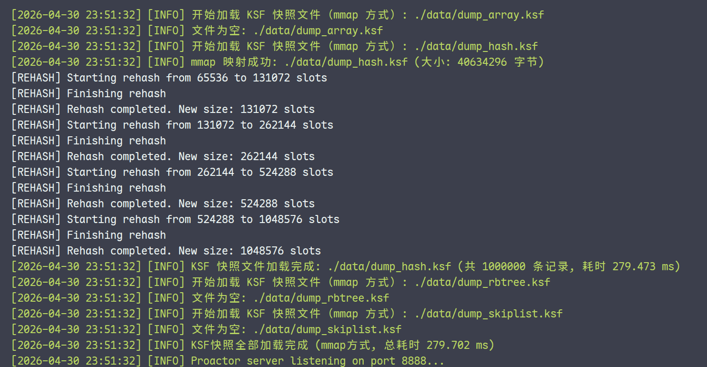
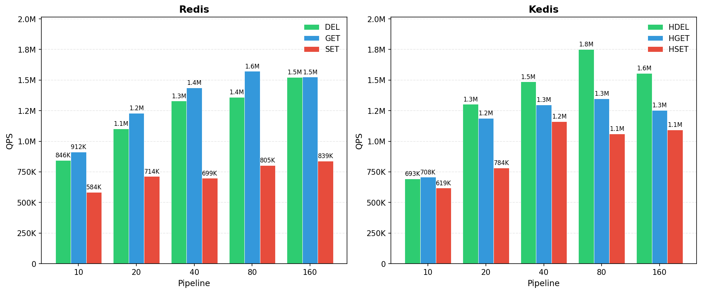
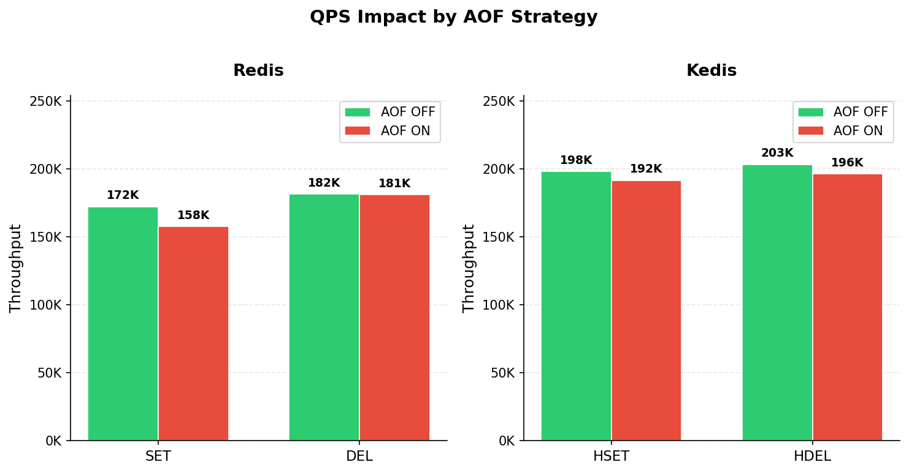
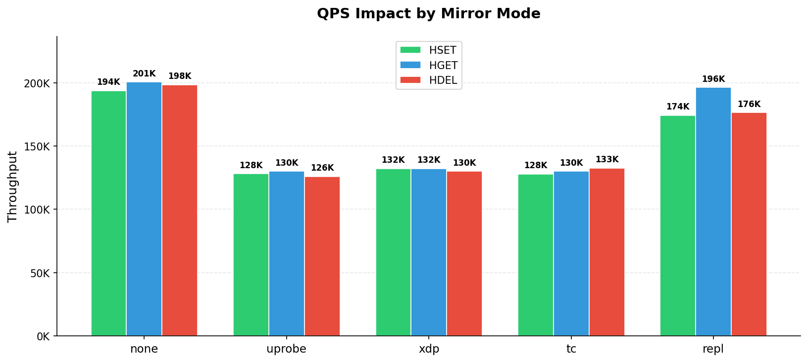
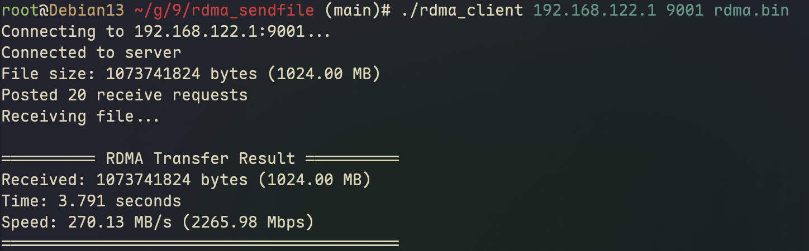
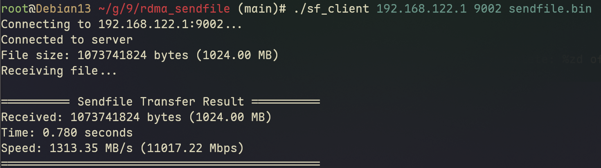

# Kedis: 高性能 Linux 内核增强型存储系统

[](LICENSE)
[]()
[]()

Kedis 是一个面向极致性能设计、基于 **io_uring** 异步 I/O 框架、支持**多存储引擎**、**内核级主从同步**及 **RDMA 硬件加速**的 Key-Value 存储系统。

本项目深度集成 Linux 内核增强技术（io_uring, eBPF, mmap）和 RDMA 技术，旨在构建一个能够支撑百万级并发、低延迟、且具备非侵入式实时数据同步能力的高性能存储基座。本项目尝试从用户态到内核态探索全栈优化的可能性，希望能为高性能服务器架构、内核驱动开发及分布式系统相关研究提供一些参考。

---

## 目录

- [Kedis: 高性能 Linux 内核增强型存储系统](#kedis-高性能-linux-内核增强型存储系统)
  - [目录](#目录)
  - [项目介绍](#项目介绍)
    - [核心架构亮点](#核心架构亮点)
    - [核心组件说明](#核心组件说明)
  - [架构设计](#架构设计)
    - [网络模型：基于 io\_uring 的 Proactor](#网络模型基于-io_uring-的-proactor)
    - [同步体系：eBPF 实时增量 + RDMA 存量全量](#同步体系ebpf-实时增量--rdma-存量全量)
    - [存储引擎：四种数据结构组成的多引擎架构](#存储引擎四种数据结构组成的多引擎架构)
  - [Q\&A](#qa)
    - [1. 为什么引入 RDMA？TCP 的瓶颈在哪里？](#1-为什么引入-rdmatcp-的瓶颈在哪里)
    - [2. 为什么将 eBPF 主从同步模块（mirror）独立设计？](#2-为什么将-ebpf-主从同步模块mirror独立设计)
  - [快速开始](#快速开始)
    - [环境要求](#环境要求)
    - [编译依赖说明](#编译依赖说明)
      - [快速安装命令](#快速安装命令)
    - [编译构建](#编译构建)
    - [运行指南](#运行指南)
      - [启动服务器](#启动服务器)
      - [启动 eBPF 镜像同步](#启动-ebpf-镜像同步)
  - [性能测试](#性能测试)
    - [Hardware Spec](#hardware-spec)
    - [持久化性能数据](#持久化性能数据)
      - [配置文件选项](#配置文件选项)
      - [测试工具和选项](#测试工具和选项)
      - [测试结果](#测试结果)
    - [引擎性能对比测试 (SET/GET)](#引擎性能对比测试-setget)
      - [测试脚本](#测试脚本)
      - [测试配置参数](#测试配置参数)
      - [SET 操作性能](#set-操作性能)
        - [吞吐量对比](#吞吐量对比)
        - [平均延迟对比](#平均延迟对比)
        - [P99 延迟对比](#p99-延迟对比)
        - [延迟百分位数](#延迟百分位数)
      - [GET 操作性能](#get-操作性能)
        - [吞吐量对比](#吞吐量对比-1)
        - [平均延迟对比](#平均延迟对比-1)
        - [P99 延迟对比](#p99-延迟对比-1)
        - [延迟百分位数](#延迟百分位数-1)
      - [引擎综合性能雷达图](#引擎综合性能雷达图)
      - [性能汇总表](#性能汇总表)
    - [混合负载性能测试](#混合负载性能测试)
      - [测试脚本](#测试脚本-1)
      - [测试配置参数](#测试配置参数-1)
      - [吞吐量对比](#吞吐量对比-2)
      - [延迟对比](#延迟对比)
      - [性能热力图](#性能热力图)
      - [性能汇总表](#性能汇总表-1)
    - [主从复制性能对比：eBPF 镜像机制深度评测](#主从复制性能对比ebpf-镜像机制深度评测)
      - [测试动机与设计](#测试动机与设计)
      - [吞吐量对比](#吞吐量对比-3)
      - [延迟分析](#延迟分析)
        - [平均延迟](#平均延迟)
        - [P99 尾延迟](#p99-尾延迟)
        - [完整延迟百分位数](#完整延迟百分位数)
      - [性能开销总结](#性能开销总结)
      - [数据汇总表](#数据汇总表)
      - [技术决策建议](#技术决策建议)
    - [内存分配器对比测试：自研 kmem vs jemalloc](#内存分配器对比测试自研-kmem-vs-jemalloc)
      - [测试设计思路](#测试设计思路)
      - [完整内存趋势对比](#完整内存趋势对比)
      - [SET 阶段细节分析](#set-阶段细节分析)
  - [发展路线](#发展路线)
  - [贡献](#贡献)
  - [支持](#支持)
  - [许可证](#许可证)

---

## 项目介绍

Kedis 旨在打破传统存储系统在海量并发下的 I/O 瓶颈。通过基于 io_uring 的网络框架减少系统调用开销，也支持多网络框架的跨平台设计，利用 eBPF (XDP/TC) 实现旁路数据镜像，并规划引入 RDMA 实现零拷贝的主从节点存量同步。

### 核心架构亮点

1.  **全异步 I/O 栈**：基于 `io_uring` 实现了纯异步的 Proactor 网络模型，彻底解决了传统 `epoll` 在极高并发下由于频繁上下文切换导致的性能衰减。
2.  **内核旁路同步 (eBPF Mirror)**：在不修改应用层逻辑的前提下，利用 `eBPF` 在内核协议栈直接拦截 RESP 流量，实现对应用无感、极低开销的主从增量同步。
3.  **异构同步三机制**：创新性地设计了“实时增量（eBPF）+ 初始全量（RDMA）+ 应用层 RESP 传播”的组合。eBPF 确保主从实时数据一致；RDMA 保证在节点冷启动时，TB 级存量数据能以硬件级速度（Zero-copy）完成镜像复制；应用层 `repl_cmd` 链表 + `writev` 批量发送提供高可靠性的 fallback 复制路径，无单缓冲区大小限制。
4.  **mmap 快照加载冷启动**：通过 `mmap` 内存映射技术，实现 KSF 快照与 AOF 日志的亚秒级数据加载。
5.  **生产级持久化保证**：支持 **KSF 二进制快照** 与 **AOF 增量日志**，支持 `BGSAVE`，以及自定义自动快照落盘频率。
6.  **非侵入式实时同步**：基于 eBPF 的 `mirror` 模块，在内核层实现流量劫持，支持从节点实时追踪主节点状态。
7.  **智能内存管理**：内置 6 尺寸类（64B / 128B / 256B / 512B / 1KB / 2KB）slab 分配器（kmem），支持线程本地缓存（TLS）、大块内存独立管理与页对齐分配，针对 KV 常见数据分布优化。
8.  **基于 RDMA 的存量同步**：引入 RDMA 远程直接内存访问，实现主从同步中存量数据搬运的硬件级零拷贝。

### 核心组件说明

| 目录 | 组件名称 | 核心技术点 |
| :--- | :-- | :--- |
| `src/core/` | 核心调度层 | 流式 RESP 状态机、统一命令分发路由、应用层主从复制命令传播 |
| `src/network/` | 异步网络库 | io_uring 队列管理、固定文件/缓冲区优化、Fallback Reactor |
| `src/engines/` | 多索引存储引擎 | 渐进式 Hash Rehash、SkipList、RBTree 稳定查询 |
| `src/persistence/`| 高性能持久化 | VLQ 变长编码 AOF、mmap 优化快照加载、异步 fsync 线程 |
| `src/utils/` | 基础工具链 | 6 尺寸类 slab 内存池（kmem）含 TLS 缓存、高性能线程安全日志 |
| `mirror/` | eBPF 同步模块 | XDP/TC 挂载点双版本、内核态 TCP 重组、Ring Buffer 通信 |

---

## 架构设计

### 网络模型：基于 io_uring 的 Proactor

Kedis 采用真正的 Proactor 模式。传统的 `epoll` 属于“通知就绪”，应用仍需调用 `read` 将数据从内核拷贝到用户态。而 `io_uring` 允许应用直接提交请求到提交队列（SQ），内核完成后直接放入完成队列（CQ），系统调用开销减少约 70% 以上。

网络层实现了以下关键优化：
- **连接级引用计数**：`send_inflight` / `recv_inflight` 计数器配合 `dead` 延迟释放标志，确保内核完成回调前连接结构不被释放。
- **大响应零拷贝分片**：当响应超过固定 `wbuf`（4KB）时，剩余数据通过 `iov_data` / `iov_len` 引用外部缓冲区，避免额外拷贝。
- **主从复制批量发送**：每个从节点连接维护独立的 `repl_cmd` 命令链表，`flush_send_queue` 通过 `io_uring_prep_writev` 一次性提交多个非连续缓冲区，实现零拷贝批量发送，彻底移除旧设计的 8MB 缓冲区上限。

### 同步体系：eBPF 实时增量 + RDMA 存量全量

本项目将数据同步解耦为两个阶段：
1.  **初始阶段 (Full Sync)**：针对主从刚建立连接时的存量搬运，引入 **RDMA (Remote Direct Memory Access)** 技术，允许从节点直接读取主节点内存中的快照映像，实现 GB/s 级别的传输带宽。
2.  **实时阶段 (Incremental)**：提供两条并行路径：
    - **eBPF 内核镜像**：使用 eBPF 程序挂载在网络驱动（XDP）或协议栈（TC）入口。当主节点收到命令包时，mirror 直接提取 TCP 载荷，不经过用户态存储逻辑，延迟极低，且对应用完全无侵入。
    - **应用层 RESP 传播**：作为 eBPF 的高可靠性 fallback，主节点在命令执行后通过 `repl_propagate` 将写命令序列化为 RESP 格式，追加到各从节点连接的 `repl_cmd` 链表中，再由 `writev` 批量发送。该路径不依赖特定网卡或内核配置，且通过 `REPLCONF` 注册机制实现从节点自动发现与静默模式处理。

### 存储引擎：四种数据结构组成的多引擎架构

本项目采用**多存储引擎架构**: 
-   **Hash 引擎**：实现了类似 Redis 的**渐进式 Rehash** 机制，通过单次操作触发`REHASH_STEPS_PER_OP` 步进，有效规避了大表扩容时的瞬间阻塞。
-   **SkipList 引擎**：基于多级索引结构实现，确保在大规模数据量下依然具备稳定的 $O(\log N)$ 查找与更新性能。
-   **RBTree 引擎**：提供稳定的 $O(\log N)$ 查询性能，适用于对内存占用敏感且查询频率均匀的场景。
-   **Array 引擎**：针对小规模数据集或特定顺序访问场景设计的极简高效索引。

---

## Q&A

### 1. 为什么引入 RDMA？TCP 的瓶颈在哪里？
在分布式存储的**全量数据初始化**场景下，传统的 TCP 同步存在多次内存拷贝和高频协议栈中断开销。RDMA 支持硬件层面的零拷贝（Zero-copy）和内核旁路，允许从节点绕过主节点 CPU 直接读取内存。在 TB 级数据同步时，RDMA 能将 CPU 占用率降至近乎 0，同时同步效率提升一个数量级。

### 2. 为什么将 eBPF 主从同步模块（mirror）独立设计？
`mirror` 模块被设计为一个**协议无关的内核态网络插件**。由于它在内核层仅通过五元组过滤提取载荷，**完全不解析 RESP 协议**，因此具有极强的通用性。它不仅能为本项目服务，还可以无缝迁移到 **Redis、MySQL** 等任何基于 TCP 的数据库，为其实现非侵入式的流量镜像与性能监控。

---

## 快速开始

### 环境要求
- **基础工具**: `gcc`, `clang`, `make`
- **系统环境**: Linux 内核版本 5.8+ (支持 io_uring 与 eBPF ring_buf)
- **依赖库**: `liburing`, `libbpf`, `librdmacm`, `libibverbs`, `jemalloc` (可选), `pthread`

### 编译依赖说明

| 依赖库          | Arch Linux (pacman) | Debian/Ubuntu (apt) | 功能说明                 |
| --------------- | ------------------- | ------------------- | ------------------------ |
| liburing        | `liburing`          | `liburing-dev`      | io_uring 异步 I/O        |
| libbpf          | `libbpf`            | `libbpf-dev`        | eBPF 程序加载            |
| librdmacm       | `rdma-core`         | `librdmacm-dev`     | RDMA 连接管理            |
| libibverbs      | `rdma-core`         | `libibverbs-dev`    | RDMA  verbs 接口         |
| jemalloc        | `jemalloc`          | `libjemalloc-dev`   | 可选：替代 kmem 的分配器 |
| libbfd          | `binutils`          | `binutils-dev`      | BPF 字节码反汇编         |
| libcap          | `libcap`            | `libcap-dev`        | 细粒度权限控制 (CAP_BPF) |
| clang-bpf-co-re | `clang`             | `clang`             | CO-RE 重定位支持         |
| llvm            | `llvm`              | `llvm`              | BPF 后端代码生成         |

#### 快速安装命令

**Arch Linux:**

```bash
sudo pacman -S binutils libcap clang llvm
```

**Debian/Ubuntu:**

```bash
sudo apt install binutils-dev libcap-dev clang llvm
```

### 编译构建
```bash
# 1. 编译主服务器（生产模式，关闭 debug 输出）
make

# 1b. 调试模式（开启 hex dump 等详细调试信息）
make debug

# 2. 编译 eBPF 模块
cd mirror && make prebuild && make vmlinux && make all
```

### 运行指南

#### 启动服务器

```bash
# 启动服务器 (使用默认配置)
./kvstore

# 使用自定义配置文件
./kvstore <config-file-path>
```

#### 启动 eBPF 镜像同步

```bash
# XDP 版本
sudo ./mirror/src/xdp_mirror <网络接口名> <从节点IP> <从节点端口>
# TC 版本
sudo ./mirror/src/mirror <网络接口名> <从节点IP> <从节点端口>
```

#### 启动从节点（应用层复制）

从节点通过配置文件指定角色和主节点地址，启动后自动发送 `REPLCONF` 完成注册：

```bash
# 从节点配置示例 (config_slave.conf)
bind 0.0.0.0
port 9999
replica-mode slave
master-host 192.168.122.122
master-port 8888
init-mode none

# 启动从节点
./kvstore config_slave.conf
```

从节点建立连接后会自动执行：
1. 发送 `REPLCONF` 向主节点注册同步通道。
2.（可选）发送 `RDMASYNC <engine_type>` 触发 RDMA 存量全量同步。
3. 存量同步完成后，自动接收主节点通过应用层 `repl_propagate` 推送的实时写命令。

---

## 性能测试

### Hardware Spec

- **CPU**: 18 × Intel® Core™ Ultra 5 125H
- **MEM**: 32 GiB 内存 (30.9 GiB 可用)
- **Kernel**: 6.18.29-1-lts (64 位)

---

### 通用测试参数

> 以下各项 QPS 相关测试均使用同一套基准参数，便于横向对比：

```sh
HOST="127.0.0.1"
KEYS=1000000
THREADS=4
CONN=50
REQS_PER_CLIENT=$((KEYS / (THREADS * CONN)))

memtier_benchmark \
    -s ${HOST} \
    -p ${PORT} \
    --command="HSET/HDEL __key__ __data__" \
    --command-ratio=1 \
    --command-key-pattern=P \
    -t ${THREADS} \
    -c ${CONN} \
    -n ${REQS_PER_CLIENT} \
    --random-data \
    --key-prefix="k" \
    --key-minimum=1 \
    --key-maximum=${KEYS} \
    --json-out-file="$json_file" \
    --hide-histogram
```

### KSF 加载时间

*更新时间: 2026.4.30*



### Pipeline 性能：Redis VS Kedis

*更新时间: 2026.5.1*



### AOF 性能（预热后）：Redis VS Kedis

*更新时间: 2026.5.15*



### 增量同步性能

*更新时间: 2026.5.1*



### RDMA vs sendfile

#### RDMA send（soft-RoCE）



#### sendfile



### 内存分配器对比：kmem vs jemalloc

*更新时间: 2026.5.6*

#### 1. jemalloc — pidstat 内存趋势

```
❯ pidstat -r -p $(pidof kvstore) 1 200
Linux 6.18.26-2-lts (Arch)

10时17分25秒   UID       PID  minflt/s  majflt/s     VSZ     RSS   %MEM  Command
10时17分26秒  1000     81024      0.00      0.00  987108  436040   1.34  kvstore
10时17分30秒  1000     81024    205.00      0.00  987108  436472   1.35  kvstore -- 开始 SET
10时17分31秒  1000     81024   4395.00      0.00 1009636  452888   1.40  kvstore
10时17分35秒  1000     81024   2448.00      0.00 1084388  530220   1.63  kvstore
10时17分36秒  1000     81024     55.00      0.00 1084388  536868   1.65  kvstore -- 开始 DEL
10时17分37秒  1000     81024      0.00      0.00 1084388  523424   1.61  kvstore

...DEL 后 RSS 稳定在 458020 KB 左右，未完全回落
```

#### 2. kmem — pidstat 内存趋势

```
❯ pidstat -r -p $(pidof kvstore) 1 200
Linux 6.18.26-2-lts (Arch)

10时19分21秒   UID       PID  minflt/s  majflt/s     VSZ     RSS   %MEM  Command
10时19分25秒  1000     82535      0.00      0.00  999396  845468   2.61  kvstore
10时19分26秒  1000     82535   2311.00      0.00 1022436  866896   2.67  kvstore -- 开始 SET
10时19分27秒  1000     82535  10754.00      0.00 1067492  909664   2.80  kvstore
10时19分28秒  1000     82535  12289.00      0.00 1108452  958480   2.95  kvstore
10时19分29秒  1000     82535  10240.00      0.00 1149412  999376   3.08  kvstore
10时19分30秒  1000     82535   9216.00      0.00 1186276 1036096   3.19  kvstore
10时19分31秒  1000     82535  10240.00      0.00 1227236 1076848   3.32  kvstore -- 开始 DEL
10时19分32秒  1000     82535      0.00      0.00 1227236 1076848   3.32  kvstore

...DEL 后 RSS 稳定在 1076848 KB 左右，无 trim
```

#### 3. QPS 数据对比

| 分配器 | 状态 | HSET QPS | HDEL QPS |
|:------:|:----:|:--------:|:--------:|
| **jemalloc** | **未预热** | 196,813 | 201,302 |
| **jemalloc** | **预热后** | 199,344 | 199,484 |
| **kmem** | **未预热** | 192,400 | 194,944 |
| **kmem** | **预热后** | 197,804 | 196,703 |

---

## 发展路线

- [x] **RDMA 存量全量克隆**：实现基于 RDMA Read 的大规模存量数据全量同步。
- [x] **eBPF 挂载点对比研究**：已完成 XDP / TC / Uprobe 三种挂载点的主从复制性能深度评测（详见上方性能测试章节）。
- [x] **应用层 RESP 主从复制**：实现基于 `repl_cmd` 链表 + `writev` 批量发送的应用层命令传播，作为 eBPF 的高可靠性 fallback。
- [ ] **io_uring 固定缓冲区优化**：引入 `IORING_REGISTER_BUFFERS` 实现真正的零拷贝内存路径（`rbuf_ptr` 已指针化预留）。

---

## 贡献

欢迎任何形式的贡献！在提交 PR 之前，请确保已通过 `tests/` 下的测试套件。

```bash
# 运行所有功能测试（含 eBPF 增量复制测试，需要 root）
sudo tests/test.sh

# 或分别运行各模块测试
python3 tests/test_basic.py        # CRUD 跨引擎测试
python3 tests/test_aof.py          # AOF 持久化测试
python3 tests/test_snapshot.py     # KSF 快照测试
python3 tests/test_incre_repl.py   # 增量复制测试（无需 root 时测试应用层传播）
python3 tests/test_all.py          # 聚合测试

# 符合性测试
python3 tests/conformance.py
```

## 支持

如有疑问，请通过 GitHub Issues 提交反馈。

## 许可证
- 核心代码：MIT License。
- eBPF 代码：Dual BSD/GPL。

---
*最后更新: 2026-05-15*
